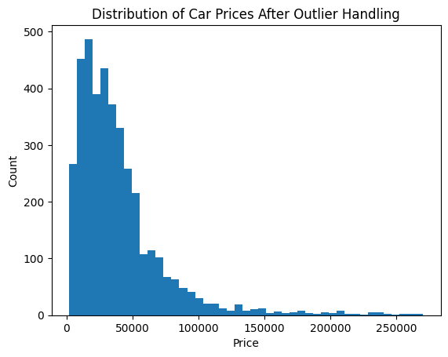
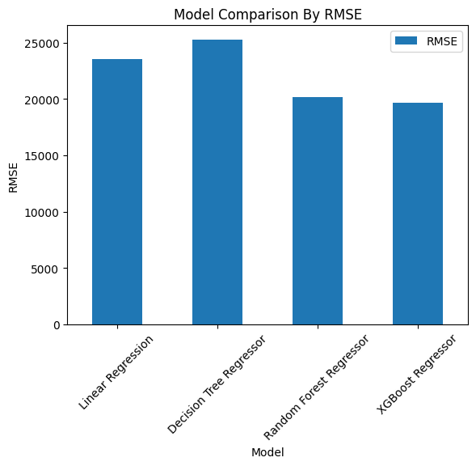
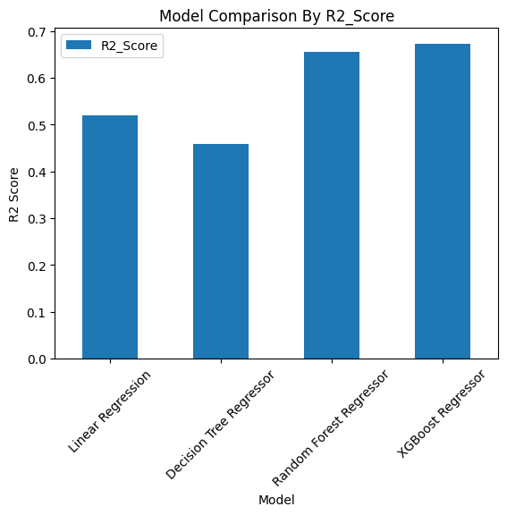
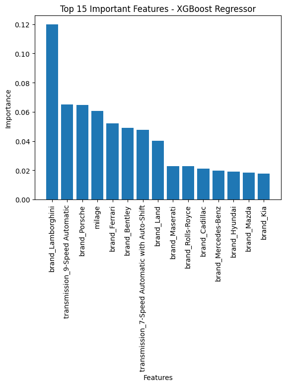

# Used Car Price Prediction using Machine Learning

## Project Overview

This project predicts used car prices using machine learning regression models.
The goal is to analyze used car features such as brand, model year, mileage, fuel type, transmission type, accident history, and clean title status to estimate the selling price of a used car.

This project is built as a portfolio-level machine learning regression project.

## Problem Statement

Used car prices depend on many factors such as age, mileage, brand, fuel type, accident history, and transmission type.
Manually estimating a fair used car price can be difficult, so this project uses machine learning models to predict car prices based on historical used car data.

## Dataset

The dataset contains used car information with features such as:

* Brand
* Model year
* Mileage
* Fuel type
* Transmission
* Accident history
* Clean title status
* Price

The target variable is:

```text
price
```

## Technologies Used

* Python
* Pandas
* NumPy
* Matplotlib
* Scikit-learn
* XGBoost
* Jupyter Notebook

## Project Workflow

1. Imported required libraries
2. Loaded the dataset
3. Performed dataset understanding
4. Checked missing values and duplicates
5. Cleaned price and mileage columns
6. Handled missing values
7. Created a new feature called `car_age`
8. Performed exploratory data analysis
9. Removed extreme price outliers
10. Selected features and target variable
11. Encoded categorical columns
12. Split data into training and testing sets
13. Trained multiple regression models
14. Evaluated model performance
15. Compared models
16. Analyzed feature importance
17. Predicted the price of a new used car

## Exploratory Data Analysis

### Price Distribution



The price distribution showed that most cars are in the lower and middle price ranges, while a few luxury cars had extremely high prices.

### Model Comparison by RMSE



RMSE was used to compare the prediction error of each model. A lower RMSE value indicates better performance.

### Model Comparison by R2 Score



R2 Score was used to measure how well each model explained the variation in car prices.

### Feature Importance



Feature importance analysis showed which features contributed most to the final model’s predictions.

## Models Used

The following regression models were trained and evaluated:

* Linear Regression
* Decision Tree Regressor
* Random Forest Regressor
* XGBoost Regressor

## Model Performance

| Model                   |       MAE |      RMSE | R2 Score |
| ----------------------- | --------: | --------: | -------: |
| Linear Regression       | 15,259.53 | 23,558.77 |    0.528 |
| Decision Tree Regressor | 15,764.47 | 25,257.13 |    0.458 |
| Random Forest Regressor | 12,392.17 | 20,149.81 |    0.655 |
| XGBoost Regressor       | 12,247.51 | 19,635.39 |    0.672 |

## Best Model

The best performing model was:

```text
XGBoost Regressor
```

It achieved the lowest error values and the highest R2 score among all tested models.

## New Car Price Prediction Example

A sample used car was tested with the trained XGBoost model:

```text
Brand: Toyota
Model Year: 2020
Mileage: 45,000
Fuel Type: Gasoline
Transmission: Automatic
Accident History: None reported
Clean Title: Yes
Car Age: 6
```

Predicted price:

```text
$41,841.09
```

## How to Run the Project

1. Clone the repository:

```bash
git clone https://github.com/YOUR_USERNAME/used-car-price-prediction-ml.git
```

2. Go into the project folder:

```bash
cd used-car-price-prediction-ml
```

3. Install required packages:

```bash
pip install -r requirements.txt
```

4. Open the notebook:

```text
notebooks/UsedCarPricePrediction.ipynb
```

5. Run all notebook cells from top to bottom.

## Project Structure

```text
used-car-price-prediction-ml/
│
├── data/
│   └── Used_Cars_Prices.csv
│
├── images/
│   ├── price_distribution.png
│   ├── model_comparison_rmse.png
│   ├── model_comparison_r2.png
│   └── feature_importance.png
│
├── notebooks/
│   └── UsedCarPricePrediction.ipynb
│
├── requirements.txt
├── README.md
├── .gitignore
└── LICENSE
```

## Future Improvements

* Add more advanced feature engineering from the engine column
* Tune model hyperparameters
* Try log transformation for car prices
* Build a Streamlit web app for price prediction
* Save the trained model using Pickle or Joblib
* Add more visualizations and business insights

## Conclusion

This project demonstrates a complete machine learning regression workflow from data cleaning and exploratory analysis to model training, evaluation, comparison, and final prediction.
